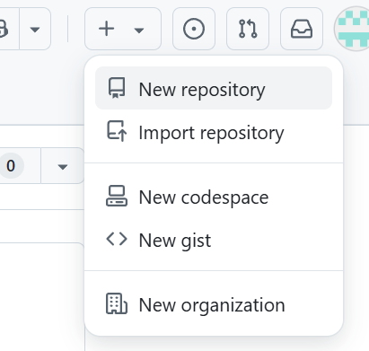
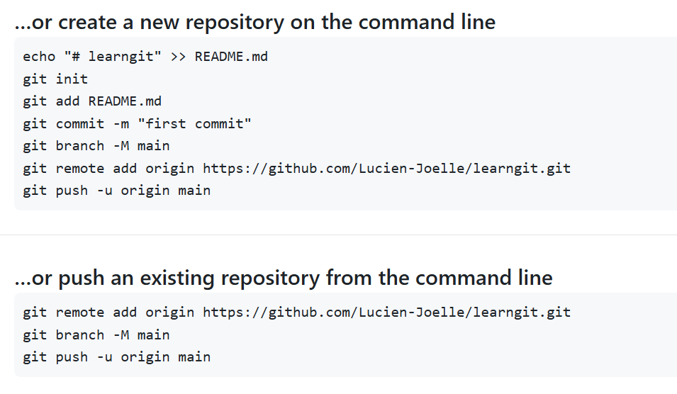

##                                                         git

## 1 Git简介

**git** : 分布式版本控制系统（DVCS，Distributed Version Control System）

- 分布式：不需要联网，在自己的机器上就可以使用
- 版本控制：记录、管理、回溯文件的修改历史
- 基于内容寻址的存储系统

**集中式版本控 制**

相当于有一个服务器图书馆，每个机子借阅，提交。但是中央服务器崩了毁了

**分布式版本控制**

每个人都有完整的版本库，大家可以互相交换修改，当然，也有一台充当中央服务器的电脑，方便交换修改。

```
工作区 -> 暂存区 -> 提交区
```


## 2 基础命令

### 2.1 创建新仓库

```bash
mkdir learngit
cd learngit
pwd #用于显示当目录
```

通过git init来使这个仓库变成git可以管理的仓库

```bash
git init
```

这时我们就拥有了一个`.git`目录。这里的东西我们不要动，否则会破坏git仓库

> 注意：不要用windows记事本编辑txt文件，使用vscode

### 2.2 创建文件

首先创建一个readme.txt文件，注意一定要放在learngit目录下，或者子目录也可以

使用`git add`把文件添加到仓库

```
git add readme.txt
```

> 没有反馈表示成功

使用`git commit`把文件提交到仓库

```
git commit -m "wrote a readme file"
```

> `- m`是本次提交的说明，最好是有意义的，方便自己读懂

>提交的反馈说明：
>
>`1 file changed`：1个文件被改动（我们新添加的readme.txt文件）
>
>`2 insertions`：插入几行内容

**注意**：add就提交一个文件。commit会把现在仓库中所有文件进行提交

### 2.3 版本控制

使用`git log`查看提交日志

```bash
git log
```

#### 2.3.1 版本倒退

我们使用`HEAD`表示当前版本，上一个版本就是`HEAD^`，上上个版本`HEAD^^`，往上100个版本`HEAD~100`

我们回退版本使用`git reset`命令

```bash
git reset --hard HEAD^
```

对于`--hard`，这个是回退到上个版本的已提交状态，`--soft`回退到上个版本未提交状态，`--mixed`回退到上个版本的未添加状态。

> 那么如果我们回退了，刚才那个最新版本已经看不到了怎么办
>
> 主要没有关掉bash，我们就可以找到刚才的commit id
>
> ```bash
> git reset --hard 1094a……
> ```
>
> 这个commit没必要写全，但是也不能太少，这个git会自动去找的
>
> 但是如果我们关闭了bash的话，可以通过
>
> ```bash
> git reflog
> ```
>
> 找到历史命，从而找到commit id，这样就可以找到之前的最新版本。

#### 2.3.2 工作区和暂存区

**工作区**：就是在电脑里面可以看到的目录，就learngit里面可以看到的

**版本库**：`.git`隐藏目录不算工作区，而是版本库

> 版本库中存了很多东西，最重要的就是名为`stage`的暂存区，还有第一分支`master`，以及指向`master`的一个指针`HEAD`。

`git add`实质上是添加文件到暂存区，`git commit`就是提交到当前分支。

>```bash
>git status
>```
>
>查看状态，`untracked`就是还没有提交的文件

`git add`可以把所有修改提交到暂存区，`git commit`可以把所有暂存区的修改提交到分支。

#### 2.3.3 管理修改

> git 的优秀在于，git 管理的是修改而不是文件

举个例子来讲

```bash
第一次修改 -> git add -> 第二次修改 -> git commit
```

那么第二次修改的不会被提交，因为`commit` 提交的是暂存区的内容，第二次的修改并没有放入暂存区，因此`git commit`只是把暂存区的内容提交了，所以第二次的修改不会被提交。

我们可以使用`git diff HEAD -- readme.txt`来查看工作区和版本库里最新版本的区别

```
-表示旧版本少了这一行
+表示新版本多了这一行
```

> 新版本指的是工作区的内容

#### 2.3.4 撤销修改

> 如果还没有把更改放到暂存区：
>
> 当然，修改不可能没有错误。当我们发现错误的时候，我们可以使用
>
> ```bash
> git checkout -- readme.txt
> ```
>
> 撤销`readme.txt`在工作区的修改。
>
> 注意 ==--== 很重要，不然我们有可能换到别的分支中。那就是`git checkout`命令了

如果我们把错误的文件已经放到暂存区了，在commit之前我们发现了这个问题。我们可以通过命令

```bash
git reset HEAD readme.txt
```

把暂存区的文件放回到工作区

#### 2.3.5 删除文件

如果我们提交了一个文件`test.txt`这时我们把他删了

```bash
rm test.txt
```

这时 git 知道工作区和版本库不一致了，我们有两个选择：

* 从版本库删除文件

```bash
git rm test.txt
git commit -m "remove test.txt"
```

* 删错了，我们恢复

```bash
git checkout -- test.txt
```

!!! warning "警告"
>
>  如果我们没有提交到暂存区就把文件删除了，那只能老老实实去看看回收站了


## 3 远程仓库

### 3.1 添加远程仓库

> 添加SSH key到Github，Github需要知道你的公钥才能确定是你推送的
>
> > 当然可以有多个，比如在宿舍一个电脑，外出办公一个电脑



创建一个New repository（仓库），名字填写一个仓库的名字（eg. learngit)



根据提示，我们在本地的`learngit`中运行

```bash
git remote add original https://github.com/LuChron/learngit.git
```

创建`original`（默认且常用）的本地仓库

然后我们就可以吧本地库的所有内容推送到远程库上

```bash
git push -u original master
```

> 这是第一次推送，所以我们加入了`-u`参数（把master推送到新的master分支，还会把本地的和远程的master分支关联起来，这样可以简化命令。

这样以后，我们就可以通过

```bash
git push original master
```

来把master的最新修改推送到github。

### 3.2 删除远程仓库

先用

```bash
git remote -v
```

查看远程仓库信息

然后用

```bash
git remote rm original
```

> **origina** 是仓库名字

进行删除

!!! danger "危险"
>
> 这里的删除并不是在github进行了删除，只是解除了远程仓库和本地的绑定关系。真正的删除需要登录到github中找到删除按钮进行删除。

### 3.3 从远程仓库中进行克隆

操作如图：


```bash
git clone 
```

> 可以把远程仓库复制到本地仓库

> 注意：git 支持多种协议，https很慢，但是有的只支持ttp，最快的是ssh协议
>
> `clone`是第一次进行克隆，`pull`是已经有了内容再次进行克隆的时候


## 4 分支管理

### 4.1 创建分支与合并分支

#### 4.1.1 概述

> 由上面的学习可以理解到，一条时间线就是一个分支。一般我们的主分支是master分支
>
> `HEAD`严格来说是指向当前分支的。

我们可以创建一个分支，那么如果我们创建了一个新的分支，那么`HEAD`就会指向这个新的分支（假设这个新的分支叫`dev`，然后我们堆这个新的分支进行修改的时候，`master` 分支不变，如果我们在新的分支上的工作完成了，我们就可以把新的分支合并到`master`上

> 所谓合并，就是直接把`master`直接指向`dev`的当前提交，这样就完成了合并

完成合并之后，我们可以删除`dev`指针，只剩下了一个`master`分支

#### 4.1.2 命令

创建分支

```bash
git branch dev    #创建分支
git checkout dev  #切换分支

/#或者可以合并为这一个命令
git checkout -b dev          #-b 参数表示创建并切换
```

 查看分支

```bash
git branch
* dev   #当前分支有*号
master
```

在`dev`分支上完成任务后，我们可以切换回`master`分支

```bash
git checkout master
```

此时我们的文件内容并没有改变，因为我们的修改是在`dev`分支上的。现在我们进行合并

```bash
git merge dev
```

这样我们把dev的内容合并到master分支上了。再次查看文件，发现和dev上是一样的。

```bash 
git branch -d dev #删除dev 分支
```

switch切换

```bash
git switch -c dev #创建并切换
git switch master #切换
```

> 不过还是`checkout`更舒服一点？

### 4.2 解决冲突

我们对分支进行修改，然后提交，回到`master`分支后，我们修改不同内容后再次提交，这是，我们的分支叉出了两个，因此无法进行快速合并，命令`git merge dev`会报错。我们修改的文件冲突必须解决后再提交。我们可以使用`git status`查看冲突文件。我们要对文件内容进行手动修改，然后提交。这样就可以解决冲突了。

最后，删除分支`git branch -d dev`

### 4.3 分支管理策略

> 在和上面一样的语境中，我们创建分支，做了修改并返回主分支后

我们可以使用

```bash
git merge --no-ff -m "merge with no-ff" dev
```

这个和`merge`有什么区别呢

就是`merge`可能采取`fast-forward`直接移动`master`指针，没有保存记录

这个`no-ff`就会强制保留分支记录并且提交，在`git log`中能看到合并的历史

#### 分支策略

我们一般在分支上每个人完成自己的工作，最后使用合并到`master`分支上

### 4.4 强行删除

> 对于还没有合并的分支我们用D进行删除
>
> ```bash
> git branch -D feature
> ```

### 4.5 多人协作

我们用`git remote`查看远程仓库信息

```bash
git remote
git remote -v #详细信息
```

我们推送的时候，要指定要推送的分支

```bash
git push original master #推送master分支
```


## 5 标签管理

> 标签相当于是版本库的快照，就类似于一个指向commit的指针（注意标签不能移动）
>
> 所以我们为什么要标签呢？commit的号码会是很长的一串，如果是tag v1.2这样的，会不会看起哎很清楚？

标签就是一个有意义的名字

### 5.1 创建标签

首先切换到要打标签的分支上

```bash
git checkout master
```

然后我们就可以打上标签

```bash
git tag v1.0
```

!!! important "重要"
>
> 注意标签是打到最新提交的commit身上的

如果我们相对之前的提交打上标签，首先使用`git log`查看提交，然后用

```bash
git tag v0.9 f52……(commit id)
```

用`git tag`查看标签

```bash
git tag
```

可以用`git show tagname`来看到说明文字

```bash
git show v1.0
```

### 5.2 操作标签

删除标签

```bash
git tag -d v1.0
```

创建的标签只是到本地，不会推送到远程，如果想推送到远程：

```bash
git push original v1.0  #推送v1.0
git push original --tags   #全部推送
```

如果标签已经推送到远程，还想再删除的话

```bash
git tag -d v1.0 #先删除本地
git push original :refs/tags/v1.0   #删除远程的格式
```


## 6 使用github

我们首先找到一个开源项目，然后用`Fork`克隆这个仓库，然后`git clone`在本地克隆

!!! warning "注意"
>
> 推送只能到自己的远程仓库中，到别人的是没有权限的

如果想要官方的库接受你的修改，可以发起一个`pull request`，看看对方是不是接受


## 7 补充知识点

### 7.1 忽略特殊文件

> 如果一些特殊文件在工作区不能提交，但是每次都提示，我们可以创建一个`gitgnore`文件，把要忽略的文件名字填进去，git会自动忽略这些文件
>
> 忽略的原则
>
> >1. 忽略操作系统自动生成的文件，比如缩略图等；
> >2. 忽略编译生成的中间文件、可执行文件等，也就是如果一个文件是通过另一个文件自动生成的，那自动生成的文件就没必要放进版本库，比如编译产生的`.exe`文件；
> >3. 忽略你自己的带有敏感信息的配置文件，比如存放口令的配置文件。

我们添加的时候

```bash
git add readme.txt
```

发现被忽略

我们可以用`git check-ignore`查看那里出错了

==注意==，`.gitgnore`放到哪个文件夹根目录下，对哪个文件夹起作用

**写法：**

```bash
# 排除所有.开头的隐藏文件:
.*
# 排除所有.exe文件:
*.class

# 不排除.gitignore
!.gitignore
```


